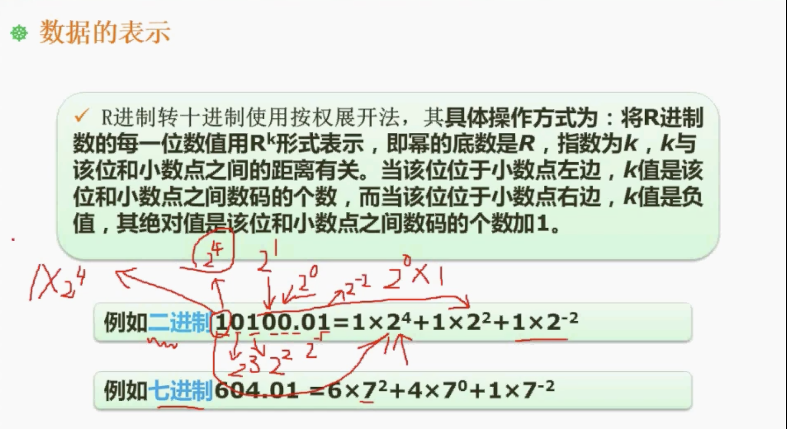
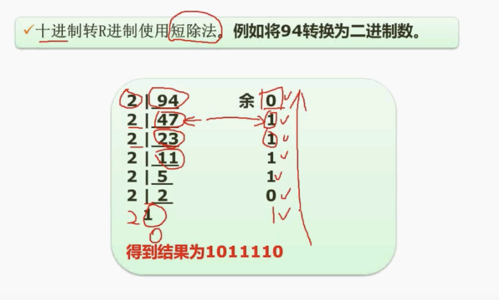
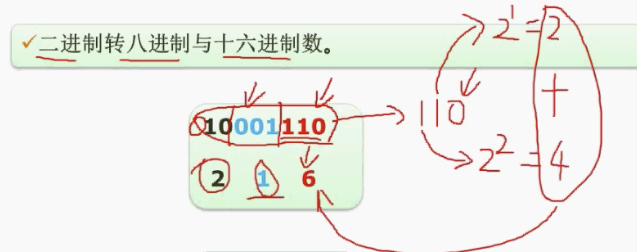
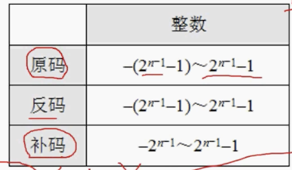
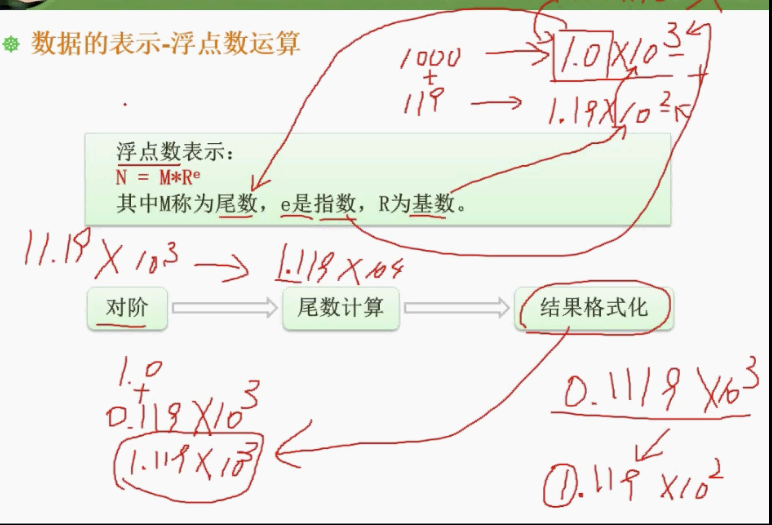

# 02 数据的表示

## 2.1 : 进制转换

### R 进制转十进制: 按权展开

+ 按权展开分别乘以对应位置上的权值
  + 底数等于 R进制中的 R. (如 2进制转10进制则底数为 2, 8进制则底数为 8)
  + 整数部分是从右向左, 指数从 0 开始累加
  + 小数部分是从左向右, 指数从 -1 开始递减
  + 权值指 R 进制中对应位置上的值 ( 如 2 进制中对应位置上的值是 0 或 1)



### 十进制转 R 进制: 短除法

+ 隐藏的知识点: 余数一定比除数小.
+ 除数等于 R 进制中的 R.
+ 十进制要一直除直到商为 0, (由下图可见, 当被除数比除数小时, 余数为 1 商为0)
+ 所有余数逆序排列即为要转换的二进制数.



### 二进制转八进制

二进制转八进制, 把二进制数从右往左3 个化为一组, 不足 3 位则用 0 补齐, 然后分别计算出和即可.

如图所示:

+ 从右往左把二进制 `10 001 110` 分为 3 组
+ 110 对应的十进制是 6, 001 对应的十进制是 1, 10 对应的十进制是 2
+ 所以: 二进制 `10001110` 对应的八进制是 `216`



### 二进制转十六进制

从右往左把二进制数四个数为一组进行划分, 其他方法与二进制转十六进制相同

在十六进制中, 由于从 10 开始会占二位, 所以在十六进制中用大写字母表示从 10 ~ 16 的数.

| 10   | A    |
| ---- | ---- |
| 11   | B    |
| 12   | C    |
| 13   | D    |
| 14   | E    |
| 15   | F    |

例子:

+  `10001110` 划分为 `1000 1110` 两组
+ `1110` 是 `2+4+8`, 是 14, 对应 E
+ `1000` 是 8, 

### 十六进制转二进制

十六进制每一位都可以变为 4 位二进制.

### 十六进制转八进制

1. 十六进制转为二进制.
2. 二进制转为八进制.

## 2.2 数据编码

### 原码, 反码, 补码和移码

假设存储系统是 8 位的:

+ **原码**: 首位是符号位表示1个数的正负, 其余位表示数值. 

  ```
  // 原码并不能完全表示数学运算, 当计算 1+(-1) 时原码的运算结果是 -2
  
    0000 0001
  + 1000 0001
  ------------
    1000 0010 
  
  // 1000 0010 的十进制是 -2
  ```

+ **反码**: 正数的反码不变, 负数的反码是除符号位外其余位取反.

```
// 计算 -1 的反码
1000 0001 // -1 的二进制表示
1111 1110 // -1 的反码

// 计算 1 + (-1)的反码
  0000 0001
+ 1111 1110
-------------
  1111 1111

// 1111 1111 是 1+(-1)的反码 的计算结果
// 那 1 + (-1) 要取刚才结果的原码
// 即: 1111 1111 的原码是 1000 0000 
// 1000 0000 的十进制是 -0
```

+ **补码**: 反码加 1.

```
// -1 的补码是 1111 1111

// 1 + (-1) 的补码为:
  0000 0001
+ 1111 1111 
-------------
 10000 0000

// 由于是 8 位的系统, 所以 1 这个数溢出了, 结果是 0000 0000
```

+ 移码: 补码的符号位取反.

### 数值的表示范围

+ 原码和反码的取值范围都是 `-(2^(n-1) -1) ~ 2^(n-1) -1`
+ 补码的取值范围比原码大, 是因为补码中没有-0, 所以节省了一位的空间.



## 2.3 浮点数运算

在计算机中使用科学计数法表示浮点数的运算.

科学计数法表示法: `x = a * 10ⁿ`, 其中  1 ≤ a < 10, a 称为尾数, n 是指数, 10 是基数

科学计数法进行运算时:

1. 对阶: 需要先把小指数的数扩大, 这种方法叫做对阶.
2. 尾数计算
3. 结果格式化



