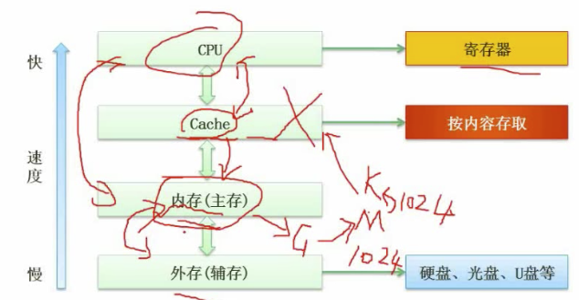

# 05 层次化的存储结构

## 掌握

+ 存储的整体结构
+ cache 相关
+ 内存

## 5.1 层次化的存储结构

### 知识点

+ 基本的层次是如何划分的?
+ 哪些存储器性能比较好? 寄存器和 cache
+ 哪些存储器容量比较大? 内存和外存
+ 为什么要以层次化的形式组织存储层? 
  + 基于性价比的考虑
  + 基于局部性原理设计

### 寄存器

在整个存储结构中, 速度最快效率最高的是寄存器. 寄存器位于 CPU 当中.

寄存器的容量是最小的.

### Cache

Cache: 高速缓存

Cache 的衡量单位是 K

按内存存储: 不同内容存到不同区域, 所以 Cache 又叫做相连存储器

### 内存(主存)

内存的衡量单位一般是 G

### 外存

外存即硬盘

### 图



## 5.2 Cache

### Cache 概要

+ Cache 的功能: 提高 CPU 数据输入输出的速率, 突破冯诺依曼瓶颈, 即 CPU 与存储系统间数据传送带宽限制.
+ 在计算机存储体系中, Cache 是访问速度最快的层次.
+ 使用 Cache 改善系统性能的依据是程序的局部性原理.

### Cache 命中率

CPU 会逐级向下查询所需要的数据

### 计算 "Cache+主存储器" 系统的平均周期

```
// 设缓存命中率为 h
// t1 是 cache 的周期时间
// t2 是主存储器的周期时间

h * t1 + (1-h) * t2
```

### Cache 失效率(未命中率)

```
1 - h
```

## 5.3 局部性原理

局部性原理大致可分为: 

+ 时间局部性
+ 空间局部性

### 时间局部性

时间局部性所举的例子是 2 层 for 循环, 把内层 for 循环的内容放到 Cache 中, CPU 就不用去内存中去获取. 这就是时间局部性. 即在一定时间内, CPU 访问的数据可以缓存起来加速.

### 空间局部性

例子: CPU 访问数组的项, 访问第一项后, 很可能接下来访问第 2 项, 这样把整个数据缓存起来, 可以提高效率.

### 工作集原理

工作集是进程运行时被频繁访问的页面集合

## 5.4 主存

### 主存分类

主存的分类主要是 2 种:

+ 随机存取存储器
  + RAM: Radom Access Memory.
  + 断电后存储的数据会丢失.
  + 随机存储是指读写的数据与数据的位置无关
+ 只读存储器
  + ROM: Read Only Memory.
  + 只读存储器读的数据是出厂前已经写好的, (出厂前把数据写入这就叫做烧制) 如操作系统的开机程序

### 主存-编址

**主存的编址**

主存的编址: 把芯片组成相应的存储器.

**存储器的规格**

`8 * 4 位的存储器`: 8 代表 8 位地址空间, 4 代表每个地址空间存储了 4 个 bit 位的存储信息.


