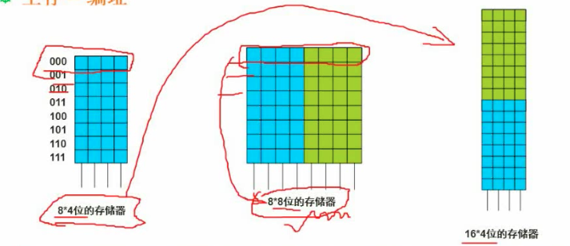

# 05 层次化的存储结构

## 掌握

+ 存储的整体结构
+ cache 相关
+ 内存

## 5.1 层次化的存储结构

### 知识点

+ 基本的层次是如何划分的?
+ 哪些存储器性能比较好? 寄存器和 cache
+ 哪些存储器容量比较大? 内存和外存
+ 为什么要以层次化的形式组织存储层? 
  + 基于性价比的考虑
  + 基于局部性原理设计

### 寄存器

在整个存储结构中, 速度最快效率最高的是寄存器. 寄存器位于 CPU 当中.

寄存器的容量是最小的.

### Cache

Cache: 高速缓存

Cache 的衡量单位是 K

按内存存储: 不同内容存到不同区域, 所以 Cache 又叫做相连存储器

### 内存(主存)

内存的衡量单位一般是 G

### 外存

外存即硬盘

### 图


## 5.2 Cache

### Cache 概要

+ Cache 的功能: 提高 CPU 数据输入输出的速率, 突破冯诺依曼瓶颈, 即 CPU 与存储系统间数据传送带宽限制.
+ 在计算机存储体系中, Cache 是访问速度最快的层次.
+ 使用 Cache 改善系统性能的依据是程序的局部性原理.

### Cache 命中率

CPU 会逐级向下查询所需要的数据

### 计算 "Cache+主存储器" 系统的平均周期

```
// 设缓存命中率为 h
// t1 是 cache 的周期时间
// t2 是主存储器的周期时间

h * t1 + (1-h) * t2
```

### Cache 失效率(未命中率)

```
1 - h
```

## 5.3 局部性原理

局部性原理大致可分为: 

+ 时间局部性
+ 空间局部性

### 时间局部性

时间局部性所举的例子是 2 层 for 循环, 把内层 for 循环的内容放到 Cache 中, CPU 就不用去内存中去获取. 这就是时间局部性. 即在一定时间内, CPU 访问的数据可以缓存起来加速.

### 空间局部性

例子: CPU 访问数组的项, 访问第一项后, 很可能接下来访问第 2 项, 这样把整个数据缓存起来, 可以提高效率.

### 工作集原理

工作集是进程运行时被频繁访问的页面集合

## 5.4 主存

### 主存分类

主存的分类主要是 2 种:

+ 随机存取存储器
  + RAM: Radom Access Memory.
  + 断电后存储的数据会丢失.
  + 随机存储是指读写的数据与数据的位置无关
+ 只读存储器
  + ROM: Read Only Memory.
  + 只读存储器读的数据是出厂前已经写好的, (出厂前把数据写入这就叫做烧制) 如操作系统的开机程序

### 主存-编址

**主存的编址**

主存的编址: 把芯片组成相应的存储器.

**存储器的规格**

`8 * 4 位的存储器`: 8 代表 8 位地址空间, 4 代表每个地址空间存储了 4 个 bit 位的存储信息.

**存储器组合**

两种存储方式, 增加地址或增加存储空间.



**考察: 计算地址单元**

计算公式: `高位地址 - 地位地址 + 1`

H 表示这是十六进制, 不参与计算.

内存地址从 AC000H 到 C7FFFH, 共有__ K个地址单元.

+ AC000H 代表是十六进制.
+ K 代表是 KB.
+ 计算地址单元的公式: `高位地址 - 地位地址 + 1`

所以:

```
C7FFF - AC000 + 1 = 1C000

// 1C000 转为十进制为 12*16^3 + 16^4

// K化为整数是 1024, 1024 是 2^10
(12*16^3 + 16^4)2^10 = 112
```

详细过程:

```
  C7FFF - AC000 + 1
= C7FFF + 1 - AC000
= C8000 - AC000

  C8000
- AC000
---------
  1C000 
  
// 又因为题目中问的是多少 K个(K是1024, 2的10次方), 所以还需要把 1C000 转为十进制再除以 1024

1 C000
C * 16^3 + 16^4
3*2^2 * 2^12 + 2^16

(3*2^14+2^16) / 2^10 = 3*2^4 + 2^6 = 48 + 64 = 112
```

内存地址从 AC000H 到 C7FFFH, 共有__ K个地址单元, 如果该内存地址按字(16bit)编码, 由 28 片存储器芯片构成. 已知构成此内存的芯片每片有 16K 个存储单元, 则该芯片每个存储单元存储 __ 位.

> 这道题后面部分相当于我们需要1块 112K * 16 规格的芯片, 现在已知该芯片是由 28 片 16K * X 规格的小芯片构成的, 求 X 的值.

```
112K* 16
---------
28 * 16K * X

// 结果为 4
```


