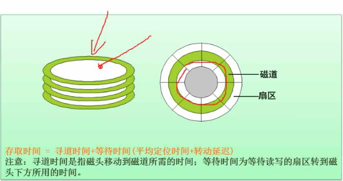
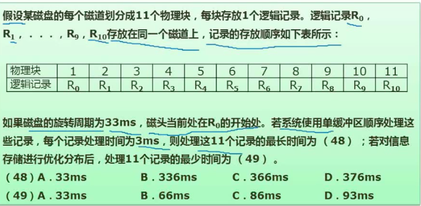
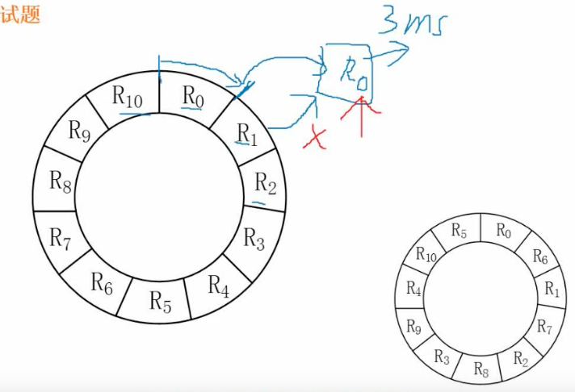

# 06 磁盘工作原理

## 6.1 磁盘结构与参数



**磁盘**是一个环形的盘片上面涂上特殊的材质保存数据, 读取数据使用**磁头**. (和唱片差不多)

磁盘上一圈圈的同心圆叫做磁道, 磁头通过磁盘旋转就能读取信息.

**多碟磁盘**: 有多个盘面, 每个盘面保存一定的信息.

**寻道时间**: 磁头读取信息时需要先把磁头定位到磁道上, 这需要消耗一定的时间, 这个时间被称为**寻道时间**

**旋转延迟时间**: 一个磁道上分很多扇区, 假设我们需要读取的数据在扇区 A, 此时磁头在 B 点. 磁头需要等到磁盘转到扇区A 与 B 点重合时才能读取扇区 A的数据.

+ 最差情况下: 旋转延迟时间 = 磁盘旋转一周的时间. 
+ 平均情况下旋转延迟时间也等于磁盘旋转时间.

### 计算存取时间(读取一个盘块需要花多少时间)

```
存储时间 = 寻道时间 + 等待时间(平均定位时间 + 转动延迟)
```

### 试题





+ 磁盘旋转周期是 33 ms, 11 个扇区, 读取一个扇区需要的时间是 3 ms
+ 系统使用单缓冲区顺序处理这些记录
  + 单缓冲区的意思是: 当读取完 R0 后不能立即把 R1 的数据读取缓冲区, 因为缓冲区的数据处理需要 3 ms, 直接读取 R1 的话, 可能会把 R0 的数据覆盖. 所以把 R0 的数据放入到缓冲区后, 必须等 3 ms, CPU 处理完后再读取下一个扇区
  + 顺序读取: 要按照 R0, R1, R2 ... 的顺序进行处理

6 + (33+3) * 10 =  366 ms

33 + 3 的意思是 R0 后面的格子每个需要转1周+3ms 才能读取.

最优时间: 即不需要等待, 穿插着来, 1 个扇区读取加处理需要 6ms, 那么总共就需要 66ms

## 6.2 计算机总线

### 总线的三种类型

根据总线所处的位置不同, 总线通常可以被分为三种类型, 分别是:

+ 内部总线: 芯片级别
  + 微机内部各个外围的芯片和与处理器之间的总线. 
+ 系统总线
  + 插线板和系统之间的总线
+ 外部总线
  + 微机和外部设备

### 系统总线

系统总线可分为:

+ 数据总线: 传输数据用的. 数据总线决定了电脑是 32 位还是 64 位. 32 位指系统一次可以传递 32 个 bit 位的信息.
+ 地址总线: 如果电脑是 32 位, 那么地址总线是 2^32 的寻址空间, 电脑管理的内存是 4 G
+ 控制总线: 发送响应的控制信号

