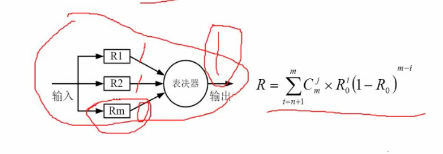
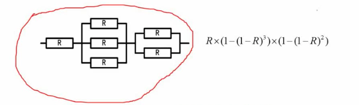

# 07 串联系统与并联系统可靠度计算

## 7.1 考察方式

串并联交织在一起的模型, 计算其可靠度

## 7.2 串联系统

### 计算串联系统可靠性

单个系统模块的可靠性为 n, 有 m 个模块, 串联系统的总可靠率为: n ^ m.

### 计算串联系统的失效率

```
// 精确计算
1 - n ^ m
```

## 7.3 并联系统

### 计算并联系统的可考虑

单个系统模块的可靠性为 n, 有 m 个模块

```
1 - (1-n)^m
```

## 7.4 N 模冗余系统



Rm 个模块独立计算, 通过表决器来确定最终的结果.

## 7.5 混合系统

