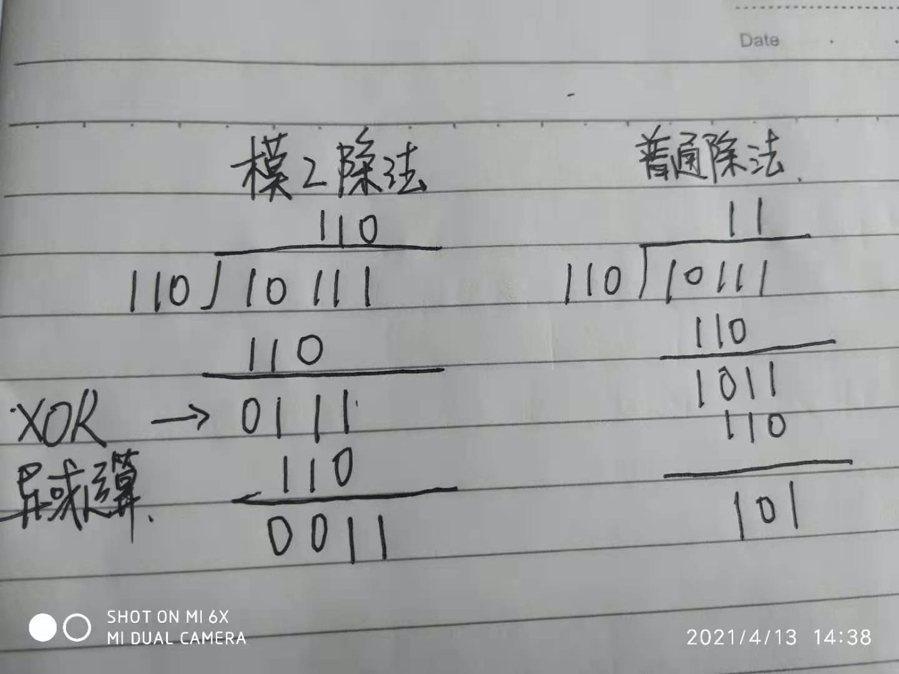
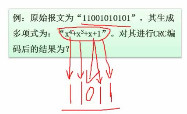
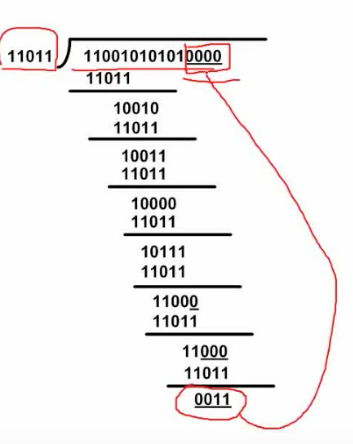
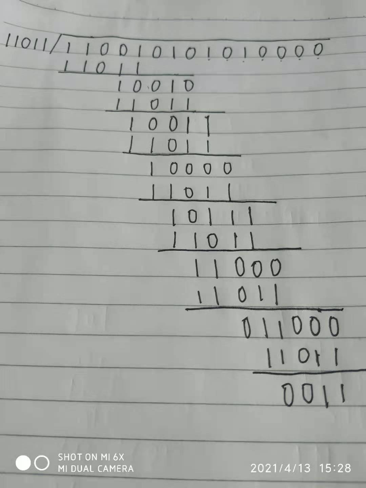
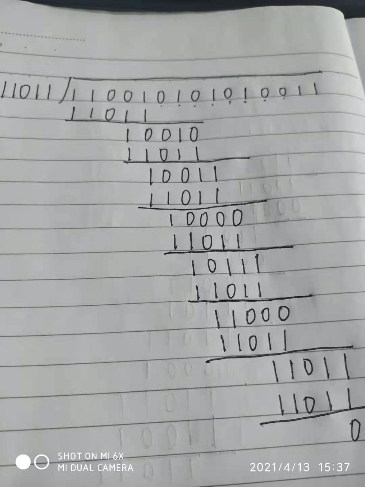
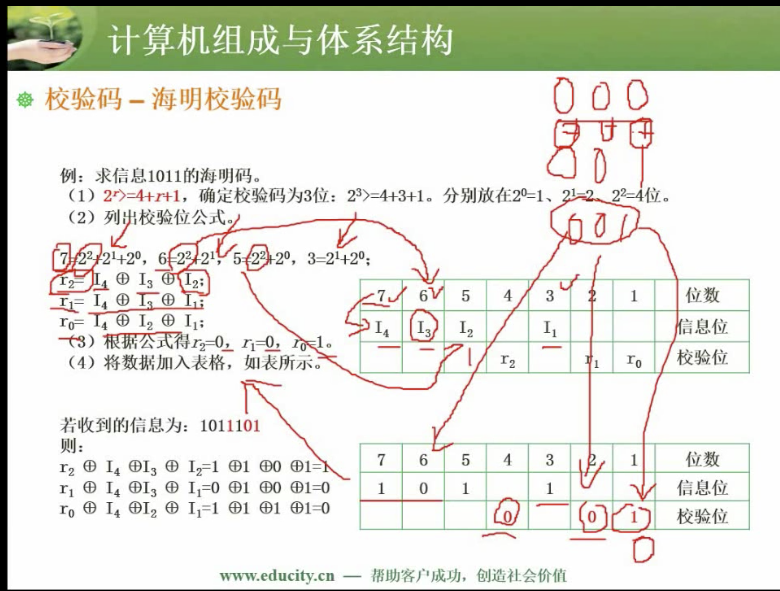

# 08 校验码

## 8.1 校验码基础概念

**什么是检错和纠错?**

+ 检错: 检查出错误
+ 纠错: 纠正出错误

手段: 增加冗余信息

### 什么是码距?

码距是任意(所有)两个码字的最小举例. (即1个码字有多少个 bit 位变化时会变成另一个码字, 所以码距一般等于码字的长度)

## 8.2 循环校验码 CRC

循环校验码 CRC 是一种可以检测但是不能纠错的校验码

### 基本原理

基本原理: 在编码的尾部加入校验信息, 让编码后的数据和循环校验码的生成多项式相除余数为 0. 

### 计算特点: 模2除法

**异或运算**: 相同为0, 相异为 1 



### 例题

原始报文为 "11001010101", 其生成多项式为 "x^4 + x^3 + x + 1". 对其进行 CRC 编码后的结果为?

+ 首先把多项式 "x^4 + x^3 + x + 1" 转为二进制, x 的多少次方指示的是对应的是二进制位是 0 还是1 . 如果存在则是 1, 不存在为 1,  原始报文对应的二进制位是 "11011"



+ 在原始报文的后面加上: 原始报文对应二进制位长度 -1 个0. (补 0 是为了补余数的位数)
+ 加 0 后的原始报文 模2除法 原始报文对应的二进制



 

+ 把求出来的余数部分添加到原始报文后面, 即 "110010101010011" 这就是 CRC编码后的结果.
+ 该 CRC 编码后的结果与 110111 进行模2的运算, 得到的余数为 0 时, 说明信息传递中没有出现错误.



## 8.3 海明校验码

### 考点

是考试的难点, 也经常考

### 海明校验码的校验位和信息位 

校验位: 2 的 n 次方位是校验码的位置

信息位: 非校验位就是信息位

### 信息位与校验位之间的关系

```
// x 是信息位
// r 是校验位的个数

2^r ≥ x + r + 1
```

例: x = 5 时即有 5 个信息位时, 校验位的个数是:  `2^r ≥ r + 6`,  枚举可知 r 必须大于等于 4

### 根据信息位求出校验位

信息位是 I4, I3, I2, I1 求 r2, r1, r0 

| 7    | 6    | 5    | 4    | 3    | 2    | 1    | 位数   |
| ---- | ---- | ---- | ---- | ---- | ---- | ---- | ------ |
| I4   | I3   | I2   |      | I1   |      |      | 信息位 |
|      |      |      | r2   |      | r1   | r0   | 校验位 |

思路:

+ 信息位对应的位置可以做如下分解:

```
7 = 2^2 + 2^1 + 2^0
6 = 2^2 + 2^1
5 = 2^2 + 2^0	
3 = 2^1 + 2^0
```

+ r2 是 2^2 位置上的校验码, 上述信息位中与 2^2 相关的信息位是 7, 6, 5 . 所以:

```
// 异或, exclusive or, 简介 eor
r2 = I4 eor I3 eor I2

// 同理
r1 = I4 eor I3 eor I1
r0 = I4 eor I2 eor I1
```

+ 假设 I4 = 1, I3 = 0, I2=1, I1 = 1, 根据上面的公式可知:

```
r2 = 1 eor 0 eor 1 // 0
r1 = 1 eor 0 eor 1 // 0
r0 = 1 eor 1 eor 1 // 1
```

### 海明校验码纠错

接收方收到编码后, 会根据上述计算公式, 重新根据信息码计算校验码. 

接收方自己计算出的校验码如果与收到的校验码进行异或操作:

+ 如果结果为0, 则说明信息位完全是正确的.
+ 如果不为 1, 转换为十进制, 则是对应的出错位置. 如下图所示: 
  + 如果是 001, 则说明是第 1 位出错.
  + 如果是 010, 则是第 2 位出错.
  + 如果是 110, 则是第 6 位出错.



