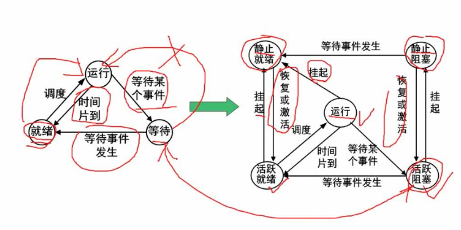
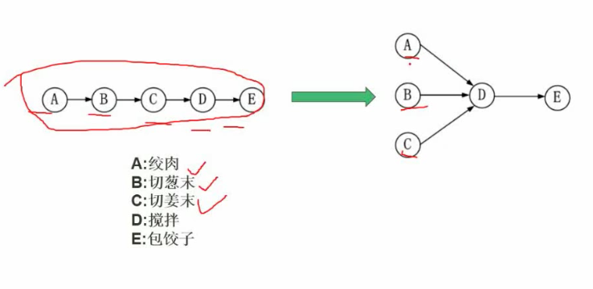
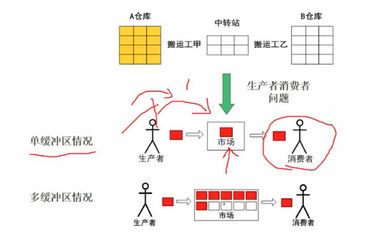
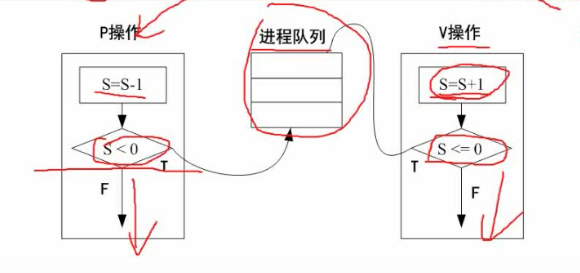
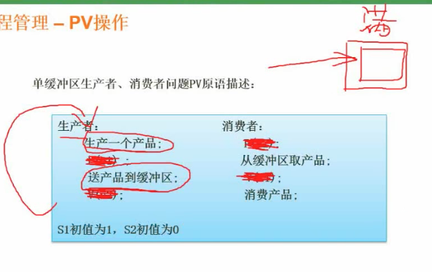
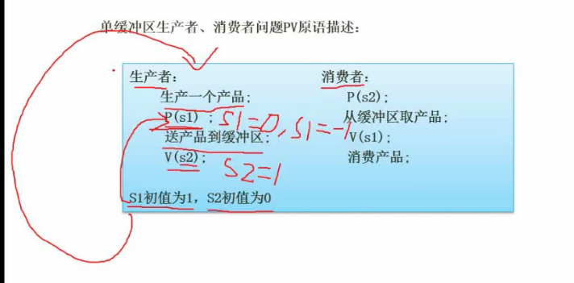
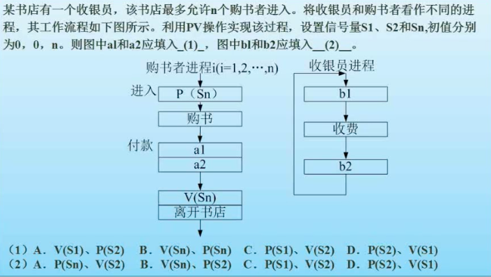

# 02 进程

## 2.1 进程的状态

### 三态模型

进程分为运行, 等待和就绪三种状态.

+ 等待: 等待是指等待某个事件发生, 发生后进程变为就绪态.
+ 就绪: 进程等到分给它的时间片后就可以运行了.

三态模型的缺陷: 过于简单, 没有考虑到主动挂起的情况.

### 五态模型

在三态模型上增加了静止就绪和静止阻塞两种状态.

## 2.2 前驱图(常考)

前驱图就是流程图, 表示任务的并行和任务的先后关系

## 2.3 进程的同步与互斥

### 同步与互斥

+ 互斥: 只能有一个进程占用该资源.
+ 同步: 两个程序速度有差异, 在一定条件下需要等待

### 生产者与消费者

单缓冲区的情况:  市场是互斥的, 同一时刻只允许一个货物在市场.

生产者与消费者是同步的, 生产者在市场已满的情况下不能继续搬运货物, 需要等待消费者消费.

## 2.4 PV 操作(难点)

### 概念

+ 临界资源: 诸进程间需要互斥方式对其进行共享的资源, 如打印机, 磁带机等
+ 临界区: 每个进程中访问临界资源的那段代码称为临界区. (*临界区就是代码段*)
+ 信号量: 一种特殊的变量

### PV 操作原理

PV 操作是荷兰语, 通过 passeren, 释放 vrijgeven

S 是信号量, 是一个整数:

+ S ≥ 0, 表示可供并发程序使用的资源实体数.
+ S ＜ 0, 表示 ISI  正在等待使用资源实体的进程数.

+ 执行 P 操作时, S 自减1 :
  +  如果 S < 0 (说明当前没有资源), 所以把进程放入到进程队列中. 进程进入等待状态
  + S >= 0 , 进行执行该进程.
+ V 操作是一个反向的操作, S 自加 1:
  + 如果 S <= 0, 则被放入队列中不会继续往下执行.
  + 如果 S > 0, 则继续往下执行.

### PV 操作例1

**PV 操作要解决的问题**

如果没有 PV 操作去协调生产者和消费者:

+ 生产者在未消费的情况下连续生成商品就会发生溢出
+ 消费者在未生产的情况下连续消费商品同样会发生异常

**PV操作如何解决生产者问题的**

加入 PV 操作后: S1 初始值为 1 , S2 初始值为 0.

+ 生产一个产品
+ P(s1) => s1 = 0. (因为 P(s1) 会执行 s 自减 1)
+ s1 = 0 不满足 s 小于 0 的条件, 程序继续往下执行, 即 "送产品到缓冲区"
+ V(s2) => s2 = 1. ( V(s2) 会执行 s 的自增操作)
+ ...................
+ 生产第二个产品
+ P(s1) => s1 = -1
+ S1 = -1 满足 s ＜ 0 的条件, 会把该程序放入程序队列. 后续的条件不会继续执行.
+ .................. 上述情况说明, 在第一个产品没有消费之前, 第 2 个产品不会送到产品缓冲区. 
+ 此时消费者的情况:
  + S2 = 1.
  + P(s2) => s2 = 0
  + s2 = 0 , 会从等待队列中获取一个进程进行激活.

以上是假设生产者先进行的, 可以考虑*消费者一开始先执行*.

+ P(s2) => s2 = -1. (P(s) 操作会自减)
+ 此时 s2 = -1 , 满足 s <= 0 的条件, 程序会被放入到程序队列中. 不会继续往下执行.

### PV 操作练习题

+ 注意到: 信号量 S1, S2 和 Sn 的初始值分别为 0, 0, n.
+ 进入 P (Sn) 的含义: 因为 n 肯定大于 0, 所以 P(Sn) 是放入 n 个人进入书店购书.
+ 付款-a1: 
  + 如果是 P 操作, 无论是 P(S1) 还是 P(S2) 都因为 S1, S2 的初始值是 0, 导致程序进入挂起状态. (X)
  + 如果是 V 操作, V 允许后续操作进行, (对)
+ 付款-a2: (与收银员 b2 是一对)
  + 如果是 P 操作, 消费刚才生产的 S+1 , 正确. 
  + 如果是 V 操作, S 又加 1, S 至少 大于 1, 不能阻塞后续操作, 可能会导致收银未完成离开书店, 不正确.
+ 收银员进程-b1: (因为付款和收银, 分别相当于生产者和消费者, 付款-a1 相当于生产者生产了一个产品)
  + 如果是 P 操作, P 会在 S 小于 0 时阻塞, 又因为 付款-a1 正好生产了一个, 所以 a1, b1 是一对.
  + 如果是 V 操作, 不合理, 因为 S1 和 S2 的初始值都是 0 , 加 1 后不会挂起, 此时没有读者需要收费.
+ 收银员进程-b2: (此时收银员是收银完成动作的生产者) 
  + 如果是 P 操作, 因 S 的初始值是 0 P 操作后为 -1, 挂起. 不正确. 
  + 如果是 V 操作, S 可顺序完成, 进行下一个循环, 正确.

